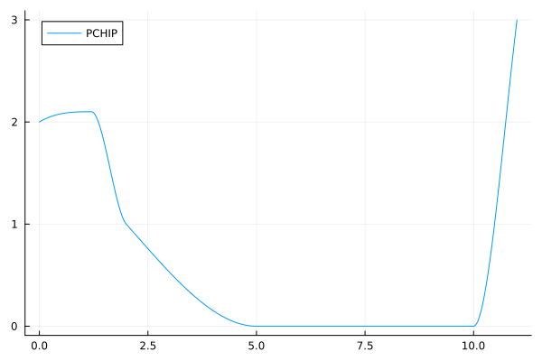

# PCHIPInterpolation.jl

[](https://github.com/gerlero/PCHIPInterpolation.jl/actions/workflows/CI.yml?query=branch%3Amain)
[](https://codecov.io/gh/gerlero/PCHIPInterpolation.jl)
[](https://JuliaCI.github.io/NanosoldierReports/pkgeval_badges/P/PCHIPInterpolation.html)
[](https://github.com/SciML/SciMLStyle)

PCHIP (Piecewise Cubic Hermite Interpolating Polynomial) spline interpolation of arbitrarily spaced one-dimensional data in Julia. This package is a fork of [SimplePCHIP](https://github.com/slabanja/SimplePCHIP) with some extra features.

PCHIP interpolation preserves monotonicity (i.e., it will not over- or undershoot monotonic data points). See [this SciPy documentation page](https://docs.scipy.org/doc/scipy/reference/generated/scipy.interpolate.PchipInterpolator.html) for more details.


## Summary

### Load the package

```jl
using PCHIPInterpolation
```

You will be prompted to install the package if you do not already have it.

### Create a PCHIP interpolator

```jl
xs = [0.0,  1.2,  2.0,  5.0, 10.0, 11.0]
ys = [2.0,  2.1,  1.0,  0.0,  0.0,  3.0]

itp = Interpolator(xs, ys)
```

The `xs` and `ys` inputs to the `Interpolator` can be of any subtype of [`AbstractVector`](https://docs.julialang.org/en/v1/base/arrays/#Base.AbstractVector), including the default Julia [`Vector`](https://docs.julialang.org/en/v1/base/arrays/#Base.Vector) (as in the example), custom vector types from other packages, and [ranges](https://docs.julialang.org/en/v1/base/collections/#Base.AbstractRange) (e.g., ``1:2:5``).

### Evaluate

```jl
y = itp(1.5) # At a single point
ys = itp.(xs) # At multiple points
```

### Plot (with [Plots](https://github.com/JuliaPlots/Plots.jl))

```jl
using Plots

plot(itp, markers=true, label="PCHIP")
```



The monotonicity-preserving property of PCHIP interpolation can be clearly seen in the plot.

### Compute a definite integral

```jl
integral = integrate(itp, 1, 3) # Integral between 1 and 3
```

### Compute a derivative (with [ForwardDiff](https://github.com/JuliaDiff/ForwardDiff.jl))

```jl
using ForwardDiff

dydx = ForwardDiff.derivative(itp, 1.5)
```

### General cubic Hermite spline

A different `Interpolator` constructor also exists that takes the derivative values at the interpolation points as a third argument. This method will create a generic [cubic Hermite spline](https://docs.scipy.org/doc/scipy/reference/generated/scipy.interpolate.CubicHermiteSpline.html), which will not preserve monotonicity in general.
